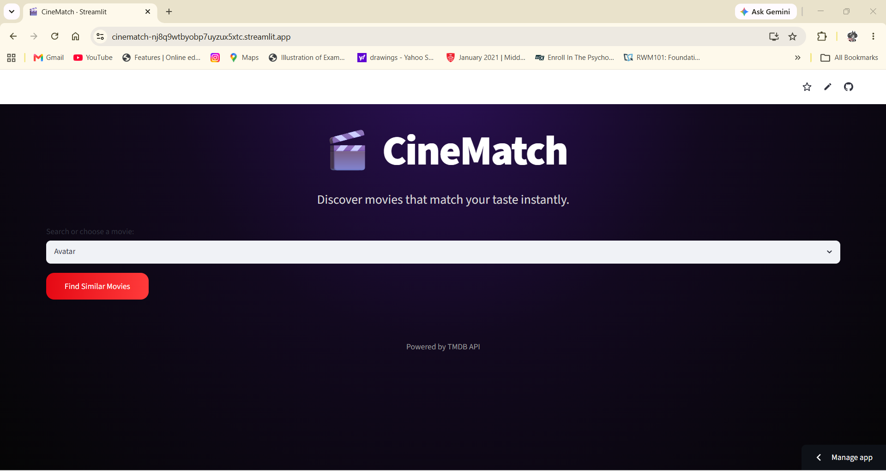
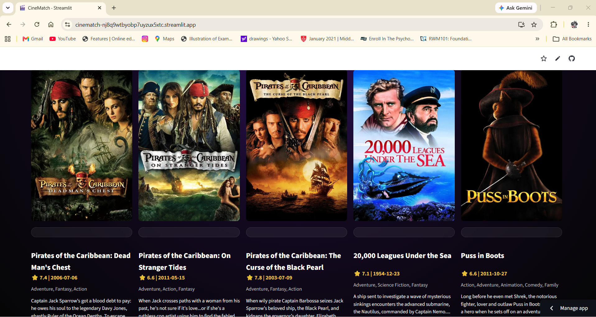
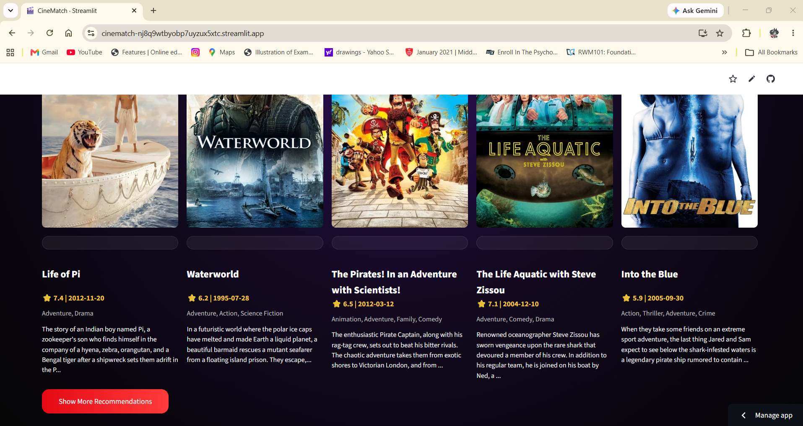

# 🎬 CineMatch

CineMatch is a movie recommendation web app that helps users discover similar movies based on their selected movie. It uses content-based filtering and displays real movie posters, ratings, genres, release dates, and descriptions using the TMDB API.

## 🚀 Features

* Search and select a movie
* Get similar movie recommendations
* View real movie posters
* See movie ratings
* See release dates
* See genres and short descriptions
* Show more recommendations
* Modern cinematic UI

## 🌐 Live Demo

https://cinematch-nj8q9wtbyobp7uyzux5xtc.streamlit.app/

## 🧠 How It Works

CineMatch uses content-based filtering.

The system combines movie features such as:

* Overview
* Genres
* Keywords
* Cast
* Crew

These features are converted into numerical vectors using `CountVectorizer`.

Then, `Cosine Similarity` is used to find movies that are most similar to the selected movie.

## 🛠️ Technologies Used

* Python
* Pandas
* Scikit-learn
* Streamlit
* TMDB API
* Requests
* Python-dotenv

## 📂 Dataset

This project uses the TMDB 5000 Movie Dataset.

Download the dataset from Kaggle:

https://www.kaggle.com/datasets/tmdb/tmdb-movie-metadata

Place these files inside the project folder:

* `tmdb_5000_movies.csv`
* `tmdb_5000_credits.csv`

## ⚙️ Installation

Clone the repository:

```bash
git clone https://github.com/samaa-faisal/cinematch.git
```

Go to the project folder:

```bash
cd cinematch
```

Install dependencies:

```bash
pip install -r requirements.txt
```

Create a `.env` file:

```env
TMDB_API_KEY="2a8febc0480e47be990805acebb25cba"
```

Run the app:

```bash
python -m streamlit run app.py
```

## 🔐 API Key

This project uses the TMDB API to fetch posters and movie details.

Do not upload your `.env` file to GitHub.

## 📸 Screenshots

### Home Page


### Recommendations


### More Recommendations


## 🌱 Future Improvements

* User login
* Save favorite movies
* Watchlist feature
* Personalized recommendations
* Trailer preview

## 👩‍💻 Author

Samaa Faisal
